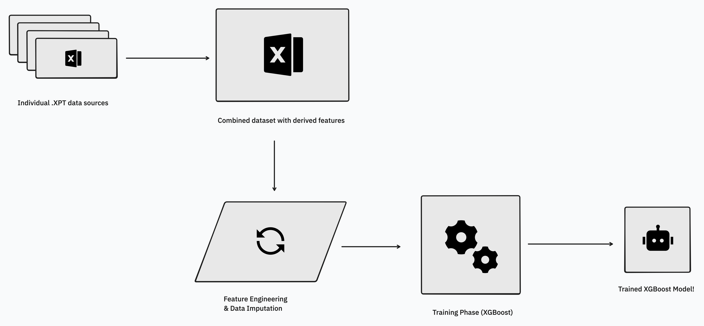

# PulseAid - Team LightX

PulseAid is a hypertension and cardiovascular risk monitoring app built with Flutter, FastAPI, and XGBoost trained on NHANES data. This is Team LightX's hackathon submission for the Cavista 2026 Hackathon.

## Table Of Contents

- [User Flow](#user-flow)
- [Hypertension Classification](#hypertension-classification)
- [Core Features](#core-features)
- [Mobile App](#mobile-app)
- [Backend API](#backend-api)
- [Hypertension Classification Model](#hypertension-classification-model)

## User Flow

The user starts with an onboarding screen where they enter physiological data: weight, height, average sleep time, stress levels, gender, and smoking status. They then link a smartwatch, which feeds in real-time biometrics including blood pressure, blood oxygen, breathing rate, and heart rate.
From there, the user can optionally enrich the analysis by uploading facial and eye images (for skin and ocular indicators) and providing natural language input via speech or text describing symptoms like dizziness or anxiety.
Once data collection is complete, the backend returns a hypertension stage classification, a progression risk likelihood, and personalized preventive measures such as daily health tips, lifestyle changes, and check-up reminders. The user can then export the full report in a format suitable for medical professionals.

## Hypertension Classification

The app follows the American College of Cardiology's four-stage framework: 

- Normal (below 120/80 mmHg)
- Elevated (120-129 / below 80 mmHg)
- Stage 1 Hypertension (130-139 / 80-89 mmHg) 
- and Stage 2 Hypertension (140+ / 90+ mmHg)

## Core Features

- Hypertension and cardiovascular risk analysis from multi-modal data (wearable, visual, conversational)
- Contextual chat using prior analysis as memory
- Facial scan quick analysis
- Smartwatch sync for live biometrics
- Report export for clinical use

## Mobile App

Todo

## Backend API

Todo

## Hypertension Classification Model

This module implements a multi-class classifier using XGBoost with the National Health And Nutrition Examination survey (NHANES) dataset.

### Training Architecture

|         Architecture Overview           |
|       :---------------:       |
|   |

The model is a multi-class XGBoost classifier trained to predict hypertension stage (Normal, Elevated, Stage 1, Stage 2) per ACC/AHA 2017 guidelines.

**Feature Extraction:** Raw NHANES XPT files are loaded and joined on the respondent ID (`SEQN`). Features are extracted from eight datasets covering blood pressure, demographics, body measures, cholesterol, glucose, smoking, and kidney function. Two derived features are computed: `pulse_pressure` and `chol_ratio`.

**Labeling:** Hypertension stage is assigned from averaged systolic/diastolic readings:

| Stage | Systolic | Diastolic |
| :- | :- | :- |
| 0 - Normal | < 120 | -- |
| 1 - Elevated | 120-129 | < 80 |
| 2 - Stage 1 HTN | 130-139 | >= 80 |
| 3 - Stage 2 HTN | >= 140 | >= 90 |

**Preprocessing:** Missing values are imputed using per-feature medians via `SimpleImputer`. The dataset is split 80/20 into train and test sets with stratified sampling on hypertension stage.

**Model:** An `XGBClassifier` is trained with `multi:softprob` objective across 4 classes. L1 (`reg_alpha=0.1`) and L2 (`reg_lambda=1.0`) regularization are applied to reduce overfitting. Hyperparameters are selected via 5-fold `GridSearchCV` optimizing weighted one-vs-rest ROC AUC, searching over estimator count, tree depth, learning rate, child weight, and subsampling ratios.

**Evaluation:** The best estimator is evaluated on the held-out test set, reporting per-class precision/recall/F1, overall accuracy, weighted AUC, a confusion matrix, and a feature importance chart.

**Outputs:** The trained model is saved as a portable `.json` file alongside the fitted imputer (`.pkl`) and a feature schema (`.json`) documenting expected inputs and planned Phase 2 features (`avg_sleep_hours`, `stress_level`, `breathing_rate`).

### Required Packages

- [xgboost](https://pypi.org/project/xgboost/): XGBoost Python Package.
- [Numpy](https://pypi.org/project/numpy/): Fundamental package for array computing in Python.
- [Pandas](https://pypi.org/project/pandas/): Powerful data structures for data analysis, time series, and statistics.
- [Scikit-Learn](https://pypi.org/project/scikit-learn/): A set of python modules for machine learning and data mining.
- [Matplotlib](https://pypi.org/project/matplotlib/): Python plotting package.
- [Seaborn](https://pypi.org/project/seaborn/): Statistical data visualization.
- [PyreadStat](https://pypi.org/project/pyreadstat/): Python package to read and write SAS, SPSS and Stata (dta) files from pandas and polars data frames.

### Downloading the Datasets

The National Health and Nutrition Examination Survey (NHANES) collects data about the health of adults and children. We can obtain the following data sources in XPT format:

| Dataset Name | Detail |
| :-          | :-     |
| Blood Pressure | Systolic and diastolic blood pressure |
| Demographics | Demographics data such as age and gender |
| Body Measures | Body measures such as Body Mass Index |
| Total Cholesterol | Total cholesterol levels |
| Blood Glucose | Respondent blood sugar levels |
| Diabetes | Respondent diabetes status (diabetic, not diabetic) |
| Smoking | Respondent smoking status (never smoked, previous smoker, current smoker) |
| Kidney Function | Creatine effects on kidney function |

This data is eventually combined into a single cohesive data set with computed/derived features.

### Local Setup

1. We use `uv` as our package manager, ensure `uv` is setup correctly. To install required packages, use the command below:
  ```sh
  uv add -r requirements.txt
  ```
2. On MacOS, OpenMP must be installed in order to use the `xgboost` library, run:
  ```sh
  brew install libomp on MacOS
  ```
3. Create and setup the Python virtual environment:
  ```sh
  python3 -m venv .venv
  source ./venv/bin/activate
  ```
4. Train the Multi-class XGBoost Classifier Model
  ```sh
  python3 ./vitals/train.py
  ```
  
### Model Evaluation

| Class | Precision | Recall | F1-Score | Support |
|---|---|---|---|---|
| Normal | 0.67 | 0.85 | 0.75 | 1127 |
| Elevated | 0.33 | 0.00 | 0.01 | 249 |
| Stage 1 HTN | 0.32 | 0.08 | 0.13 | 344 |
| Stage 2 HTN | 0.38 | 0.60 | 0.47 | 351 |
| **Accuracy** | | | **0.58** | **2071** |
| **Macro Avg** | 0.43 | 0.39 | 0.34 | 2071 |
| **Weighted Avg** | 0.52 | 0.58 | 0.51 | 2071 |

| Metric | Value |
|---|---|
| Best CV AUC | 0.7868 |
| Test Accuracy | 0.5794 |
| Test AUC | 0.7687 |

| Metric | Notes |
| :-     | :-         |
|   |  The XGBoost model classifies 4 blood pressure categories: Normal, Elevated, Stage 1 HTN, and Stage 2 HTN. Overall pattern: The model has a strong bias toward predicting Normal and Stage 2 HTN, almost ignoring the middle classes (Elevated and Stage 1 HTN). |

### Fair Use Policy (NHANES)

NHANES data is collected and published by the **Centers for Disease Control and Prevention (CDC)**, a U.S. federal government agency. Data files are released into the **public domain** and are freely available for research, educational, and commercial use without restriction.

The following conditions should be observed when using NHANES data:

- **No re-identification:** NHANES respondents participate under a guarantee of confidentiality. Do not attempt to re-identify individual participants or link NHANES records to external datasets in ways that could expose respondent identity.
- **Attribution:** When publishing results derived from NHANES data, cite the CDC/NCHS as the source and reference the specific survey cycle used (this module uses the **2017-2020 pre-pandemic cycle**, designated by the `P_` file prefix).
- **No warranty:** NHANES data is provided as-is. The CDC does not endorse any derived models, products, or conclusions drawn from the data.
- **Analytical guidelines:** NHANES employs a complex, stratified, multistage probability sampling design. This module trains a classification model and does not produce population-level estimates, so survey weights are not applied. If adapting this work to produce prevalence estimates, consult the [NHANES analytic guidelines](https://wwwn.cdc.gov/nchs/nhanes/analyticguidelines.aspx).

Full terms are available at the [NHANES Data Use Restrictions](https://www.cdc.gov/nchs/nhanes/about/data-use-restrictions.html) page.
